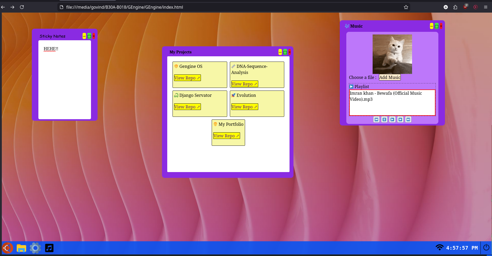

# GEngine OS
A *webOS* simulating an OS in browser. It has been created under stardance **WebOS 1 mission**. 

## Tech stack used:
1. HTML
2. CSS
3. Javascript

## Overview 
### Features
- supports multiple window
- has start menu and a taskbar
- supports dragging of window

### Apps
1. **My Projects**
- contains my repos

2. **Music**
- can play audio files

3. **Sticky Notes**
- write your notes

### Look
Inspired by Windows 10, Uwuntu, Ubuntu.....

## My journey
- Learnt Javascript (list, array, arrow function, how to make a window draggable)
- Learnt z-index and grid display in CSS
- first site without Flask or Django. 

## Future
- I will go for `web os2 mission` after this. 
- I am trying to position this web os as replacament for `my personal portfolio site`. 
- I will also create a `2D game engine` in this after learning Canvas in future properly. 
- I will learn `CSS animations` after this ship. 

## Contribution
Contribution to this repo are welcome through PR!!

## License
This is listed under `BSD 3-Clause License`.

## One Last thing
Thanks for reading!! 
Created by Govind....
